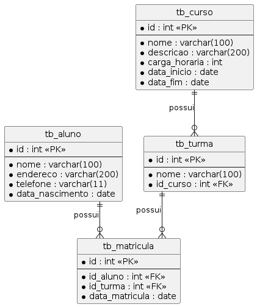

# PHP 2023/1

Repositório com os códigos criados durante os experimentos e explicações da disciplina de Programação Web II (2023/1).

## Notas Referente a atividade a ser entregue até 19/05/2023**

1 - Foram implementadas os requisitos conforme discutido em sala de aula.

2 - A página de login exibe mesagem de login inválido caso haja tentativa de logar e o usuário não acesse pelo link de entrar sem logar.

3 - Foi criado o diretório Controller para os arquivos intermediários de login e inserção.

4 - A verificação da sessão foi implementada em todos arquivos da pasta Controller, impossibilitando o acesso através da URL caso não exista uma sessão válida.

5 - Inserções nulas não poderão ser realizadas/enviadas, pois os campos de cadastro possuem o atributo required, evitando assim possíveis erros de inserção vazias.

6 - O mesmo arquivo home.php comporta o usuário logado e o usuário não logado.

7 - As datas das listagens foram formatadas para exibir no formato dd/mm/aaaa.

8 - Foi implementada links de navegação nas páginas de cadastro e listar para que o usuário possa voltar ao menu sem a necessidade de usar o botão de voltar do próprio navegador.

9 - O campo login foi definido como Unique no banco de dados.

10 - Se o usuário estiver logado, a mensagem de bem vindo é acrescida pelo seu nome.

11 - Se o usuário estiver logado, abaixo terá a implementação de destruir a sessão com o link **Encerrar sessaõ**.

12 - Se o usuário não estiver logado e estiver no menu, foi implementado um botão com a opção de **Efetuar Login**

13 - O css não foi implementado.

14 - A senha cadastrada no banco foi inserida com hash md5 e o arquivo usuario_dao.php valida a senha j

### Importante!

#### Como utilizo o apache em minha máquina, a porta utilizada para o apache mapeado no docker compose foi a porta 81. Logo acessar utilizando localhost:81/public
#### Caso queira rodar o projeto, o usuário já setado é gui e gui123 -> login e senha respectivamente.

Implementação de um CRUD.

